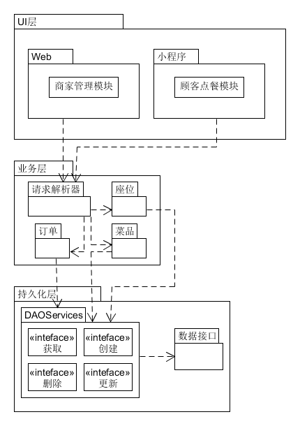
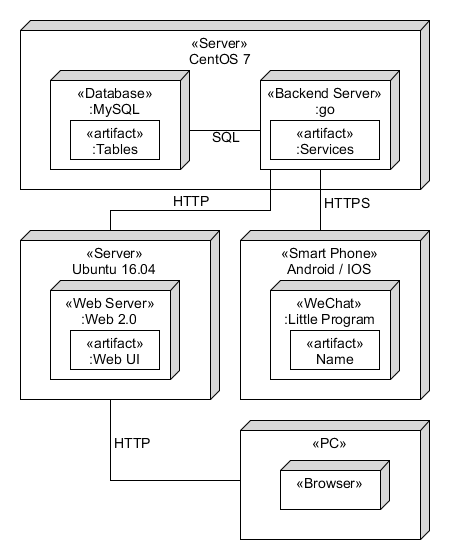

# 《好吃易点》软件架构说明书

# 文件建立/修改记录
|序号 |版本|建立或修改|建立/修改人 日期|
|:--:|:--:|:-----:|:----------------:|
|1   |1.0 |建立   |张家侨 2018年6月5日|

# 目录
<!-- TOC depthFrom:2 -->

- [《好吃易点》软件架构说明书](#)
- [文件建立/修改记录](#)
- [目录](#)
    - [1. 简介](#1)
        - [1.1. 文档编写目的](#11)
        - [1.2. 文档范围](#12)
        - [1.3. 参考资料](#13)
    - [2. 架构问题](#2)
        - [2.1. 架构可扩展性](#21)
        - [2.2. 架构可部署性](#22)
        - [2.3. 高流量应对](#23)
    - [因为本项目针对小型市场业务应用，使用人数较少，目前不存在高流量的情况，所以没有设计高流量情况的应对策略。](#)
    - [3. 解决方案说明（架构决策）](#3)
        - [3.1. 顾客点餐](#31)
            - [3.1.1. 问题：](#311)
            - [3.1.2. 解决方案：](#312)
            - [3.1.3. 动机：](#313)
        - [3.2. 商家管理](#32)
            - [3.2.1. 问题：](#321)
            - [3.2.2. 解决方案：](#322)
            - [3.2.3. 动机：](#323)
        - [3.3. 业务处理：](#33)
            - [3.3.1. 问题：](#331)
            - [3.3.2. 解决方案：](#332)
            - [3.3.3. 动机：](#333)
    - [4. 逻辑视图](#4)
    - [5. 物理视图](#5)

<!-- /TOC -->

## 1. 简介
### 1.1. 文档编写目的
本文档全面与系统地表述《好吃易点》扫码点餐系统的系统架构，并通过使用多种视图从不同角度描述系统的各个主要方面，以满足相关涉众对目标系统的不同关注焦点。 
本文档记录并描述了软件设计过程中项目经理的对需求的分析；架构师对系统架构方面做出的重要决策；项目经理根据架构定义的构结构制定项目的开发计划；开发工程师根据架构进行的各构件的详细设计；测试工程师按照架构设计的总体测试框架；此外，文档还用于指导各构件的实施，集成以及测试。

### 1.2. 文档范围
本文档适用于《好吃易点》项目的总体应用架构和相关设计。

### 1.3. 参考资料
1. 《UML和模式应用》
---
## 2. 架构问题
下面介绍本项目软件架构设计考虑的非功能性需求问题
### 2.1. 架构可扩展性
1. 水平垂直可拆封，本项目架构进行功能逻辑划分，不同模块对应自己合理的功能，不同模块功能严格分开。
2. 模块可修改，本项目架构有严格的业务逻辑分离，不同模块的修改不影响上下层模块的功能，减少代码重构。
3. 业务可伸缩。本醒目架构有针对业务的处理模块，可针对不同业务的需求增加修改对应的业务模块。

### 2.2. 架构可部署性
应用程序和数据可分开部署，本项目架构进行合适的逻辑分离，不同逻辑模块可分开部署，对于业务处理和数据，可分开部署。

###架构可测试性
架构设计可测试，除了各个结构层次自己功能可以进行单独隔离测试，各个模块间的交互测试也可以通过API间的信息传递来进行测试。

### 2.3. 高流量应对
因为本项目针对小型市场业务应用，使用人数较少，目前不存在高流量的情况，所以没有设计高流量情况的应对策略。
---
## 3. 解决方案说明（架构决策）
---
### 3.1. 顾客点餐
#### 3.1.1. 问题：
顾客移动点餐方式手段
#### 3.1.2. 解决方案：
使用**微信小程序**实现顾客点餐业务前端操作与数据展示，作为顾客点餐业务的直接载体，实现顾客点餐的移动点餐，方便用户入座即点，移动支付，点完用餐，用餐离座一系列自助快捷服务。
#### 3.1.3. 动机：
1. 顾客作为移动式的用户，手机一般不离身。
2. 微信以及移动支付手段现在已经很普及。
3. 顾客想要即坐即点式的用餐服务。

### 3.2. 商家管理
#### 3.2.1. 问题：
商家固定餐馆管理的方式手段
#### 3.2.2. 解决方案：
使用**Web**实现商家管理业务前端操作于数据显示，作为商家管理业务的直接载体，实现商家管理的固定式操作，方便商家管理餐馆，包括菜品，座位和订单。
#### 3.2.3. 动机：
1. 商家作为与餐馆绑定式用户，一般会有一台个人电脑管理数据。
2. Web端与各种电脑操作系统兼容性好，只需主机有浏览即可。
3. 固定式管理业务
4. Web端实现较为简单
### 3.3. 业务处理：
#### 3.3.1. 问题：
业务逻辑模块的位置
#### 3.3.2. 解决方案：
我们采取三层架构的设计思想，将前端只作为UI显示，后端整合业务逻辑处理和数据存储。
#### 3.3.3. 动机：
1. 方便前端开发，前端只需显示UI操作即可
2. 方便多平台前端开发，因为业务处理在后端，所以所有前端不需自己处理业务
3. 前端修改不影响业务处理
4. 前后端接口统一，高内聚低耦合

## 4. 逻辑视图

## 5. 物理视图

