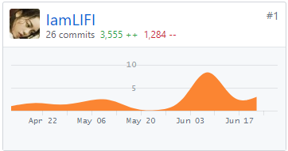
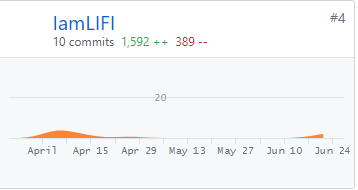

# 系统分析与设计

## 个人总结

我在系统分析与设计这门课上收获了许多的知识与经验，组队开始到建立github管理和详细的分配任务，每一步都是在细心得探索， 而这一次也对我写程序的观念有了不小的改变。最重要的一点是我们的工作中把用户需求作为开发过程的一个重心， 这个与我平时写程序只是为了写好自己看的程序而“跳过需求想到什么用例就写什么用例”完全不同，队友充分的市场调研和写的完整的美丽的用例需求极大帮助了我写小程序前端的进度。而且我在合作过程中发现一个好的需求文档能减少代码结构的组织次数和数据结构的改写次数，使得代码更加成熟。作为小程序前端开发的主要成员， 虽然会面临着迭代过程中需求的变更引起代码结构的变化的痛苦，但是这个也是必须要理解的，这个项目不是为了写出自己能用的软件，而是为了写出能给别人用的完善的软件。

在本项目创作过程中，非常感谢队友在我前端没有看到的地方的默默付出，我会拖延他们也会催我，感谢他们给我的帮助！也非常感谢老师的指导！

## PSP2.1统计表
PSP2.1|PSP阶段|预估耗时（小时）|实际耗时（小时）
:-:|:-:|:-:|:-:
Planning|计划|7|5|
Estimate|-估计这个任务需要多少时间|7|5
Development|开发|100|150
Analysis|-需求分析（包括学习新技术）|50|60
Design Spec|-生成设计文档|4|8
Design Review|-设计复审|0|0
Coding Standard|-代码规范|2|7
Design|-具体设计|19|30
Coding|-具体编码|20|35
Code Review|-代码复审|3|3 
Test|-测试|2|7
Reporting|报告|9|7
Test Report|-测试报告|3|2
Size Measurement|-计算工作量|1|1
Postmortem & Process Improvement Plan|-事后总结，并提出过程改进计划|5|4

## GIT 报告
### [SRC](https://github.com/DeliciousFoodEasyOrder/SRC)

### [DashBoard](https://github.com/DeliciousFoodEasyOrder/Dashboard)

