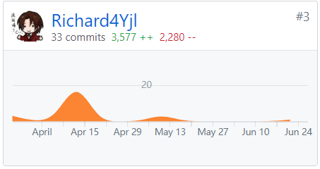

# 系统分析与设计
## 个人工作
## 个人总结
## PSP2.1统计表
PSP2.1|PSP阶段|预估耗时（小时）|实际耗时（小时）
:-:|:-:|:-:|:-:
Planning|计划|7|5|
Estimate|-估计这个任务需要多少时间|7|5
Development|开发|60|75
Analysis|-需求分析（包括学习新技术）|20|18
Design Spec|-生成设计文档|5|5
Design Review|-设计复审|1|3
Coding Standard|-代码规范|1|2
Design|-具体设计|10|15
Coding|-具体编码|20|25
Code Review|-代码复审|1|3 
Test|-测试|2|4
Reporting|报告|9|7
Test Report|-测试报告|1|2
Size Measurement|-计算工作量|1|1
Postmortem & Process Improvement Plan|-事后总结，并提出过程改进计划|7|4
## GIT统计报告
### [DashBoard](https://github.com/DeliciousFoodEasyOrder/Dashboard)

### [SRC](https://github.com/DeliciousFoodEasyOrder/SRC)
