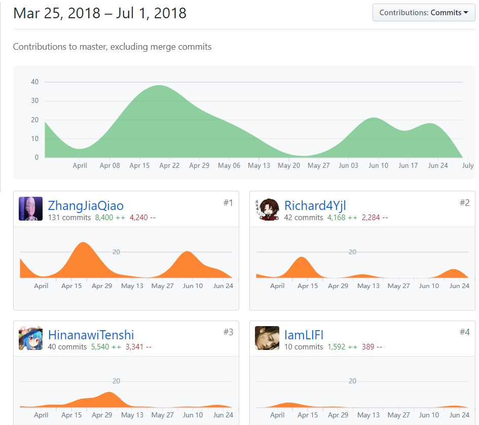
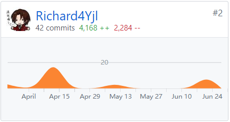
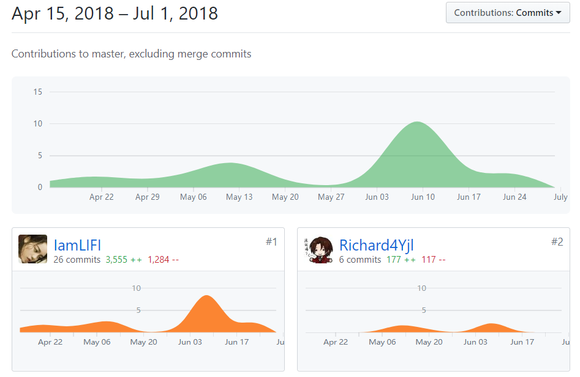
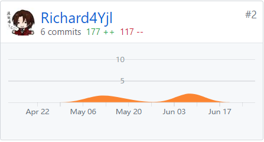

# 系统分析与设计
## 个人总结
我在系统分析与设计这门课上收获了许多的知识与经验，从一开始的市场调研和市场分析开始，我就感觉到了这次的大作业跟以往的有所不同，这次比起作业来说，更加偏向于开发，是有计划，有目标的。一个好的开发，应该把更多的时间放在文档以及各种建模上，而不是放在编码方面上。  
我一开始在队伍里负责的是“扫码点餐”的市场调研方面的事情，调研之后发现，随着二维码与手机的普及，扫码点餐逐渐的走进了大学城的一些餐厅里面，但是主流用的都是HTML来完成的。而我们当时打算跳出HTML这个范围，把前端转向了最新的微信小程序上。微信小程序更加偏向于APP的功能使得用户能获得更好的使用体验。然后我也进行了一些用例建模的部分，后来发现两个人去建模会有点浪费人力资源，所以我在开发的后半部分，去协助微信小程序的开发，帮忙开发以及调试程序。  
在这次开发的过程中，我不仅学到了有关迭代开发的知识，还体会到了团队工作中协作以及分工的重要性，作为一个项目经理，需要能够较平均的分配工作，尽量避开效率的瓶颈，多点督促一些组员干活也是十分重要的。  
十分感谢这次作业所有组员的帮助以及老师的课上的指导。
## PSP2.1统计表
PSP2.1|PSP阶段|预估耗时（小时）|实际耗时（小时）
:-:|:-:|:-:|:-:
Planning|计划|7|5|
Estimate|-估计这个任务需要多少时间|7|5
Development|开发|60|75
Analysis|-需求分析（包括学习新技术）|20|18
Design Spec|-生成设计文档|5|5
Design Review|-设计复审|1|3
Coding Standard|-代码规范|1|2
Design|-具体设计|10|15
Coding|-具体编码|20|25
Code Review|-代码复审|1|3 
Test|-测试|2|4
Reporting|报告|9|7
Test Report|-测试报告|1|2
Size Measurement|-计算工作量|1|1
Postmortem & Process Improvement Plan|-事后总结，并提出过程改进计划|7|4
## GIT统计报告
### [DashBoard](https://github.com/DeliciousFoodEasyOrder/Dashboard)

### [SRC](https://github.com/DeliciousFoodEasyOrder/SRC)

## 博客链接
[Use Case学习报告](https://blog.csdn.net/yjl_richard/article/details/79950777)
