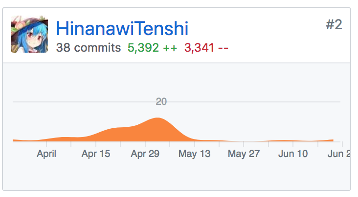
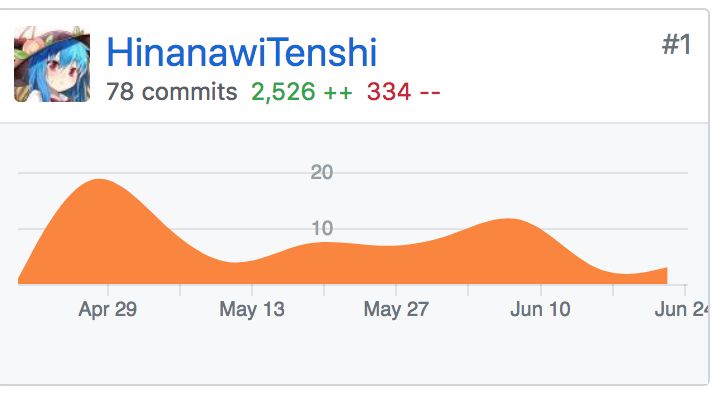

# Final Report

## 课程自我学习总结

从课程中，我体验了高标准的基于软件工程的软件开发过程，实践了完整的基于软件生命周期的开发流程，并对迭代开发有了深入的学习。

需求分析是整个开发过程中最重要的阶段，本次课程的实践让我从以往“跳过分析写代码”的方法中走了出来，开始将主要的关注点移到前置的分析与设计上来。

好的设计能极大地帮助程序编码，以往写的程序要么太简单不需要详实的设计，要么直接边写边设计，并在写完之后发现许多设计上的缺陷。通过使用成熟的设计方法，能避免缺陷，提高编码效率。

开发依然是整个生产过程要落到实处的阶段，只有用代码优美、简洁地实现设计中的要求，之前的分析和设计才能够体现出意义。开发后的测试、部署也是值的钻研的方面。

本次项目中，我要特别感谢[ZhangJiaQiao](https://github.com/ZhangJiaQiao)和[Richard4Yjl](https://github.com/Richard4Yjl)，没有他们每天熬夜撰写文档，整个小组的工作进度将无限拖延，正是他们作为项目经理呕心沥血地工作和管理，我们的项目才能走到今天；第二，我还要特别感谢[IamLIFI](https://github.com/IamLIFI)，作为直接面向广大用户的小程序工程师，他肩负着无与伦比的重大责任，但是压力并没有压垮他，他以他高强的开发能力，完美地完成了所有工作；第三，我要感谢[chenxd1996](https://github.com/chenxd1996)，他在实习的百忙之中依然义无反顾地投入到项目工作中来，出色地完成了所有任务，没有他的后台管理系统，我们的项目恍如空中楼阁，毫无意义；最后，[Tendernesszh](https://github.com/Tendernesszh)也在后端的开发中起到了无可替代的重大作用，没有他的贡献，后台服务可能将永远无法上线。

## PSP2.1 统计表

|PSP2.1|PSP阶段|预估耗时（天）|实际耗时（天）|
|---|---|---|---|
|Planning|计划|7|3|
|Estimate|- 估计这个任务需要多少时间|7|3|
|Development|开发|136|136|
|Analysis|- 需求分析(包括学习新技术)|30|30|
|Design Spec|- 生成设计文档|30|30|
|Design Review|- 设计复审|0|0|
|Coding Standard|- 代码规范|1|1|
|Design|- 具体设计|30|30|
|Coding|- 具体编码|30|30|
|Code Review|- 代码复审|0|0|
|Test|- 测试|15|15|
|Reporting|报告|15|11|
|Test Report|- 测试报告|7|7|
|Size Measurement|- 计算工作量|1|1|
|Postmortem & Process Improvement Plan|- 事后总结，并提出过程改进计划|7|3|
||合计|158|150|

## GIT 统计报告

### [Dashboard](https://github.com/DeliciousFoodEasyOrder/Dashboard)

### [REST-API](https://github.com/DeliciousFoodEasyOrder/rest-api)

## 有价值的工作清单

- **数据库设计** 根据领域模型设计数据库
- **面向资源的API设计** 形成[API文档](https://easyorder1.docs.apiary.io/)
- **面向资源的程序设计** 后台服务器的业务层和表示层设计，代码框架搭建
- **基于微服务架构的部署** 学习docker技术，构建镜像，组合镜像，部署在阿里云虚拟机上

## 博客清单

- [Golang Docker 简易使用](https://hinanawitenshi.github.io/2017/11/14/golang-docker.html)
- [Golang net/http 源码分析](https://hinanawitenshi.github.io/2017/11/13/golang-http.html)

