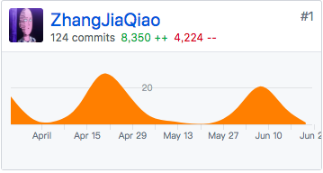

# 系统分析与设计
## 个人工作
这次团队项目中我主要负责软件的系统分析与设计的所有文档的编写以及软件的需求分析。

## 个人总结
在这次团队项目中，我切切实实感受到软件项目开发的大致流程，并且我在项目里主要是担任项目经理的角色，所以也大致了解了工程化开发的要点。
作为项目经理，所以一切与项目的调查和设计的工作都是我负责的。首先，在项目开始，我负责对餐馆点餐业务进行了调研，并参考了一款
在市面上运行的线上点餐系统“美味e点”，大致确定了业务的具体流程和需求。有了最基本的业务需求，下面就是针对客户业务的对应的最基本的系统
设计了。根据业务特点，我们设计了两个主要的系统，一个是针对顾客点餐的顾客点餐系统以及一个针对商家管理的商家管理系统，这样，两个系统
结合，就能实现整个点餐业务的主要流程。根据用户可能采取的操作，我对用例图进行了绘制，确定了用户可能会采取的操作，也方便后面的顺序图的
设计。对于点餐这个领域，我们对其中的各种对象进行了领域分析建模，确定其中的各种关键对象，确定它们的属性，这就方便后面数据库的设计。对
于业务和用例的一些流程，可能存在一些难以记住的细节，所以就需要顺序图进行迭代细化，确定其中的流程。对于剩下的分析设计的所有产品也类似，
都是为了用图或者文字细化并确定设计中的一些要点，而不是将整个项目的分析设计记在脑中。这样做的目的在于，不但方便项目的设计分析，也可以
让开发人员了解项目经理的设计与思想，而不是每个人都有自己的想法，不然会造成整个项目的各方面开发不统一。在我的理解中，项目的分析设计产
品，其主要作用就是利用统一建模语言，一种抽象的大家都可以理解的描述方式，将项目经理的设计讲述给所有的开发人员听，以统一他们的对项目的
理解与想法，这样就有利于整个项目的统一协调。

## PSP 2.1统计表
|PSP2.1|PSP阶段|预估耗时(分)|实际耗时(分)|
|:----:|:----:|:----:|:----:|
|Planning|计划|60|50|
|Research|前期调研|80|80|
|Analysis|需求分析|100|100|
|Design Spec|生成设计文档|120|100|
|Design Review|设计复审|40|50|
|Coding Standard|代码规范|40|50|
|Design|具体设计|100|110|
|Coding|具体编码|0|0|
|Code Reiview|代码复审|0|0|
|Test|测试|70|80|
|Reporting|报告|70|80|
|Test Report|测试报告|20|40|
|Size Measurement|计算工作量|15|10|
|Postmortem & Process Improvement Plan|事后总结，并提出过程改进计划|20|30|
| |合计|735|780|
## GIT统计报告
[贡献仓库](https://github.com/DeliciousFoodEasyOrder/Dashboard)

## 博客链接
1. [读书摘要](http://zhangjiaqiao.top/2018/03/17/%E4%BA%BA%E6%9C%88%E7%A5%9E%E8%AF%9D-%E6%91%98%E8%A6%8102/)
1. [敏捷开发](http://zhangjiaqiao.top/2018/04/01/%E8%BD%AF%E4%BB%B6%E5%B7%A5%E7%A8%8B-%E6%95%8F%E6%8D%B7%E5%BC%80%E5%8F%91/)
1. [Git使用](http://zhangjiaqiao.top/2018/04/15/Git%E4%BD%BF%E7%94%A8/)