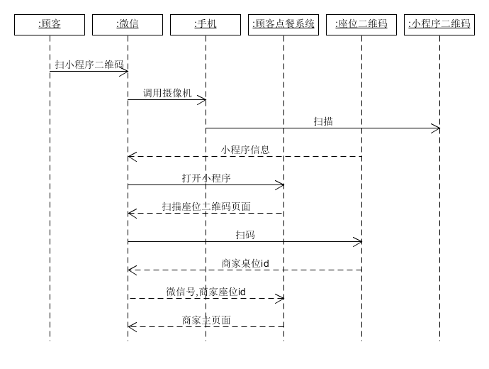

# 需求分析文档

<!-- TOC depthFrom:2 -->

- [1. 编写目的](#1-编写目的)
- [2. 活动图](#2-活动图)
    - [2.1. 商家注册](#21-商家注册)
    - [2.2. 扫码点餐](#22-扫码点餐)
- [3. 领域模型](#3-领域模型)
- [4. 顺序图](#4-顺序图)
    - [4.1. 商家注册](#41-商家注册)
    - [4.2. 商家登陆](#42-商家登陆)
    - [4.3. 商家管理座位](#43-商家管理座位)
    - [4.4. 商家管理菜单](#44-商家管理菜单)
    - [4.5. 点餐](#45-点餐)
    - [4.6. 顾客扫码登陆](#46-顾客扫码登陆)
    - [4.7. 顾客浏览历史订单](#47-顾客浏览历史订单)
- [5. 状态图](#5-状态图)
    - [5.1. 商家状态图](#51-商家状态图)
    - [5.2. 订单状态图](#52-订单状态图)
- [6. 补充需求](#6-补充需求)
- [7. 用例](#7-用例)
    - [7.1. 商家管理系统](#71-商家管理系统)
    - [7.2. 顾客点餐系统](#72-顾客点餐系统)
- [8. 用例图](#8-用例图)
    - [8.1. 顾客用例图](#81-顾客用例图)
    - [8.2. 商家用例图](#82-商家用例图)

<!-- /TOC -->

## 1. 编写目的
本文档用于整合整个软件需求分析各方面的内容

## 2. 活动图
### 2.1. 商家注册

### 2.2. 扫码点餐

## 3. 领域模型

## 4. 顺序图
### 4.1. 商家注册

### 4.2. 商家登陆

### 4.3. 商家管理座位

### 4.4. 商家管理菜单

### 4.5. 点餐

### 4.6. 顾客扫码登陆

### 4.7. 顾客浏览历史订单

## 5. 状态图
### 5.1. 商家状态图

### 5.2. 订单状态图

## 6. 补充需求
详情请见[补充需求文档](Supplementary%20Requirements/Supplementary%20Requirements.md)
## 7. 用例
### 7.1. 商家管理系统
1. [注册商家](Use%20Cases/商家管理系统_注册商家_详述用例.md)
1. [登陆系统](Use%20Cases/商家管理系统_登陆系统_摘要用例.md)
1. [管理菜品](Use%20Cases/商家管理系统_管理菜品_详述用例.md)
1. [管理订单](Use%20Cases/商家管理系统_管理订单_详述用例.md)
1. [管理餐台](Use%20Cases/商家管理系统_管理餐台_详述用例.md)

### 7.2. 顾客点餐系统
1. [扫码登陆](Use%20Cases/顾客点餐系统_扫码登陆_详述用例.md)
1. [支付订单](Use%20Cases/顾客点餐系统_扫码登陆_详述用例.md)
1. [编辑购物车](Use%20Cases/顾客点餐系统_编辑购物车_详述用例.md)
1. [选择菜品](Use%20Cases/顾客点餐系统_选择菜品_详述用例.md)

## 8. 用例图
### 8.1. 顾客用例图

### 8.2. 商家用例图
