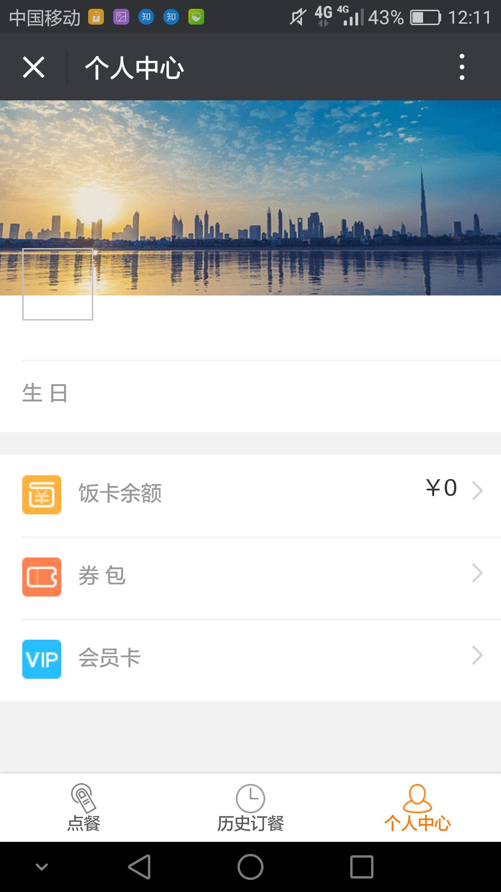
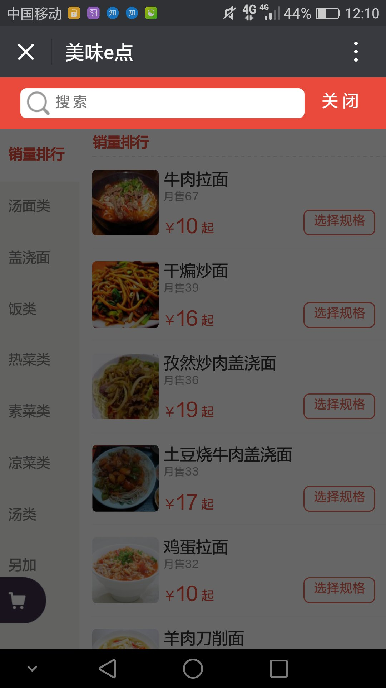
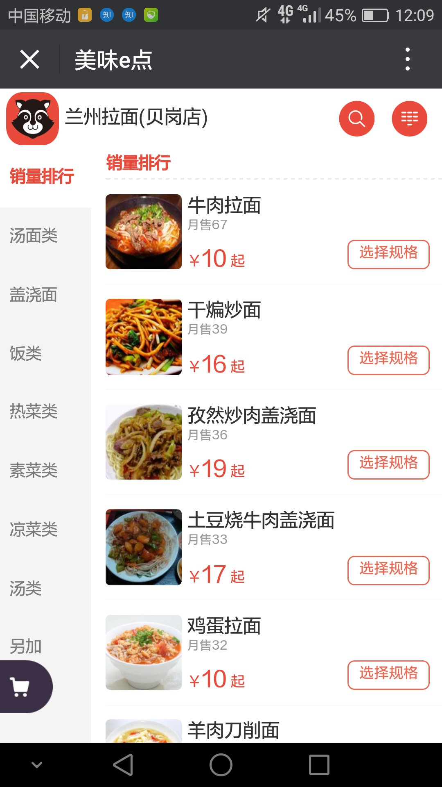
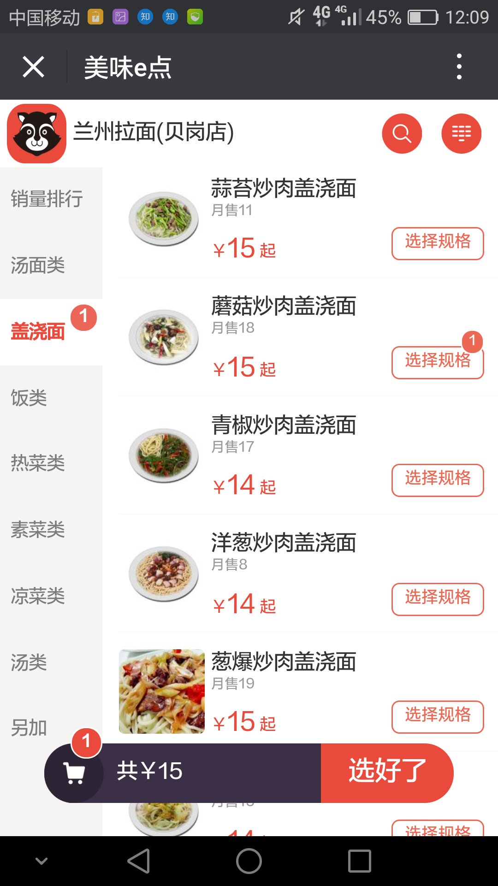
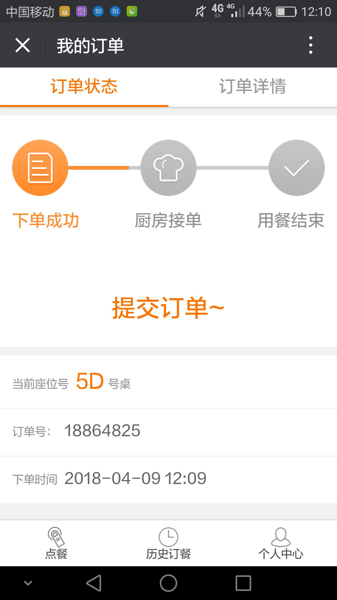
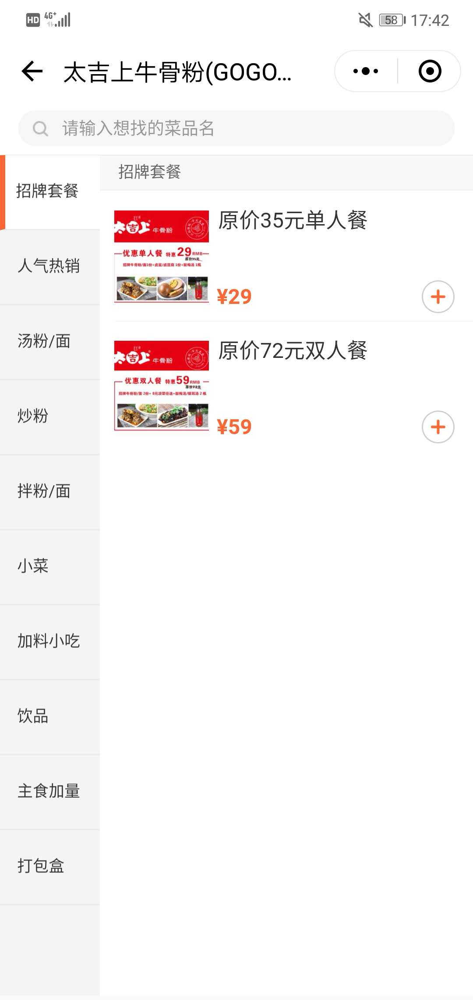
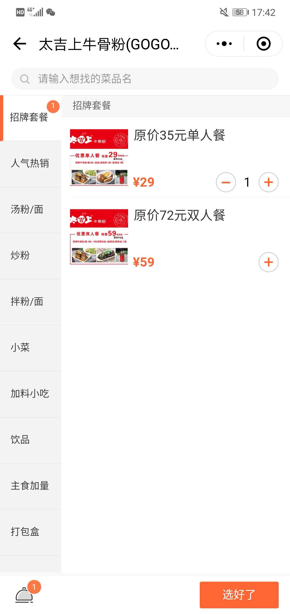
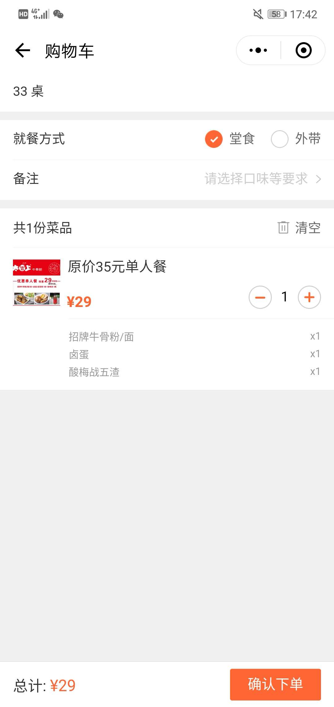
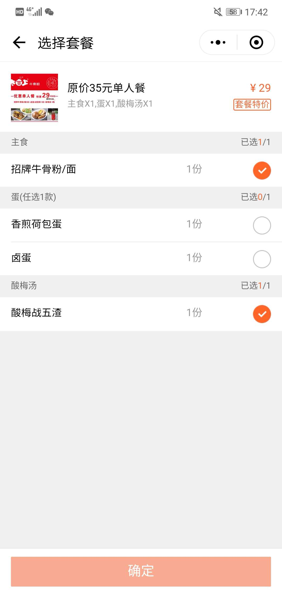

## 介绍
美味e点是大学城里面比较主流的基于Web的扫码点餐网站，而美团刚推出的扫码点餐是基于微信小程序的，属于比较新的扫码点餐方式。

### 美味E点

||
|:-:|
|个人页面|

||
|:-:|
|历史订单页面|

||
|:-:|
|搜索页面|

||
|:-:|
|点餐页面1|

||
|:-:|
|点餐页面2|

||
|:-:|
|订单页面|

### 美团的扫码点餐微信小程序

||
|:-:|
|商家页面|

||
|:-:|
|点餐页面1|

||
|:-:|
|点餐页面2|

||
|:-:|
|确认订单|

||
|:-:|
|订单页面|
